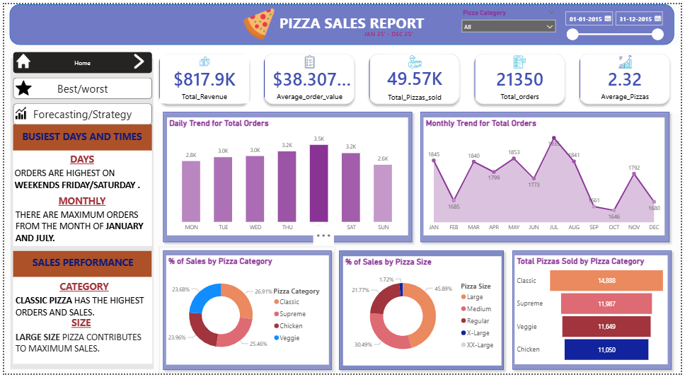
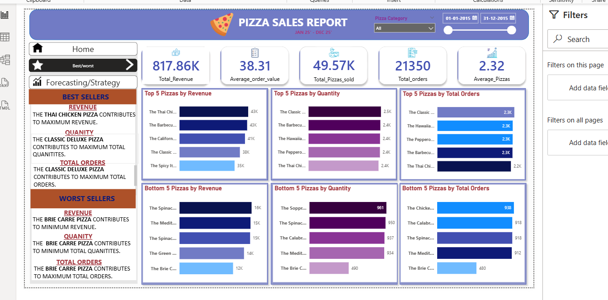
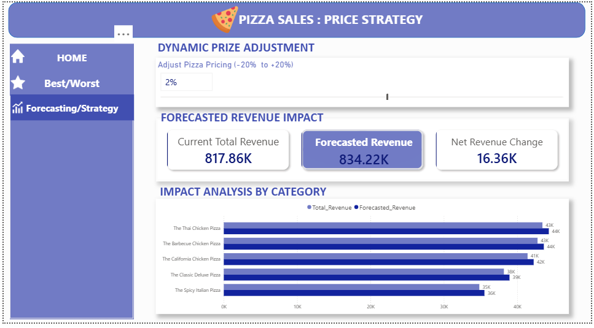

# 🍕 Pizza Sales Analytics Dashboard (Power BI)

## Project Overview
This Power BI dashboard analyzes pizza sales data to uncover business insights such as sales performance, product trends, and pricing strategy impact.

## Key Features
• KPI tracking for Revenue, Orders, Average Order Value, and Pizzas Sold  
• Daily and Monthly order trend analysis  
• Best-selling and worst-selling pizza analysis  
• Category and size distribution insights  
• Dynamic price simulation using What-If parameter  
• Forecasted revenue impact based on price adjustments  

## Dashboard Pages

### 1️⃣ Home Dashboard

### 2️⃣ Best & Worst Sellers

### 3️⃣ Price Strategy

## Tools Used
• Power BI  
• DAX   
• SQL (for validation queries)

## Business Insights
• Orders are highest on weekends (Friday/Saturday)  
• Classic pizzas generate the highest revenue  
• Large size pizzas contribute the most to sales  
• Price adjustment simulation shows potential revenue growth

• Percentage of sales by pizza category
• Percentage of sales by pizza size
• Total pizzas sold by category
• Top 5 best-selling pizzas by revenue, quantity, and orders
• Bottom 5 selling pizzas by revenue, quantity, and orders

